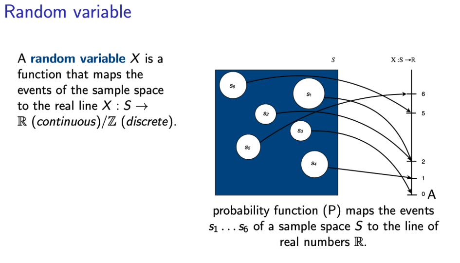

# (LT2202 V17) FACULTY OF ARTS LT2202, Statistical methods, 7,5 higher education credits Statistiska metoder, 7.5 högskolepoäng  (Second Cycle)

This repository contains course materials developed for the course on Statistical Methods in Natural Language Processing, at the University of Gothenburg.

* For the lab assigments see Mehdi's [additional information](https://github.com/mmehdig/statnlp_2017). 

# Confirmation

 The course syllabus was confirmed by The Faculty of Arts on 2011-01-17 to be valid from 2011-01-19.
Field of education: Science 100 %
Department: Department of Philosophy, Linguistics and Theory of Science

# Position in the educational system
The course is part of the 'Master in Language Technology' programme (H2MLT). It can also be offered as a freestanding course.

*Main field of studies*

Language Technology

*Specialization*

A1F, Second cycle, has second-cycle course/s as entry requirements

# Entry requirements
Passed courses:

* LT2103, Natural Language Processing 
* LT2104, Programming for NLP

or
* equivalent language technological skills and knowledge

# Course content

The purpose of this course is to give an introduction to probabilistic modeling, statistical methods and their use within the field of language technology. The following topics will be covered in the course: 

* Probability theory
* Information theory
* Statistical theory (sampling, estimation, hypothesis testing)
* Language modeling •Part-of-speech tagging
* Syntactic parsing
* Word sense disambiguation 
* Machine translation 
* Evaluation
* Learning outcomes

After completion of the course the student is expected to be able to:

# Knowledge and understanding
* account for basic notions of probability theory, information theory and statistical theory •give examples of how statistical methods have been applied in language technology systems
Skills and abilities
* apply statistical techniques to the development of language technology systems •evaluate language technology applications using standard statistical tests
Judgement and approach
* choose the appropriate statistical method for a particular task 
* evaluate the significance of statistical results

# Literature

Literature will be permanent eight weeks before course start.

# Assessment
There are laboratory exercises that require attendance for a passing grade.
The examination consists of: participation in laboratory exercises, assignments, and possibly a written exam.

# Grading scale
The grading scale comprises Fail (U), Pass (G), Pass with Distinction (VG).

# Requirements for Pass:

* completed assignments 
*participation in laboratory exercises 
* passed written exam (if any)
Requirements for Pass with distinction 
* completed assignments of good quality 
* participation in laboratory exercises
* written exam (if any) passed with distinction

A student who has failed an examination twice has the right to change examiners if it is feasible. A written application should be sent to the Board of the Department of Philosophy, Linguistics and Theory of Science.
